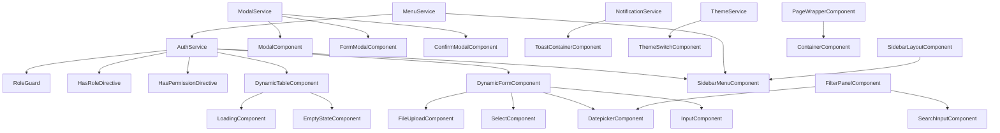

# Angular UI Komponent Kutubxonasi — Dizayn Hujjati

## Umumiy Ko'rinish

Ushbu hujjat `src/main/webapp/app/shared/ui/` papkasida joylashadigan Angular 21 UI komponent kutubxonasining texnik dizaynini tavsiflaydi. Kutubxona standalone komponentlar, Tailwind CSS 4, TypeScript 5.9 va Spring Boot JWT autentifikatsiya tizimi bilan to'liq integratsiyalashgan.

### Maqsad

- Loyiha bo'ylab qayta ishlatiladigan, izchil UI komponentlar to'plamini yaratish
- `ROLE_ADMIN` / `ROLE_USER` / `ROLE_TEACHER` rollari asosida UI elementlarini boshqarish
- `ControlValueAccessor` orqali Angular Reactive Forms bilan to'liq integratsiya
- Bitta `index.ts` dan barcha komponentlarni import qilish imkoniyati

### Texnologiyalar

| Texnologiya | Versiya | Maqsad |
|---|---|---|
| Angular | 21.1.4 | Asosiy framework |
| TypeScript | 5.9.3 | Tip xavfsizligi |
| Tailwind CSS | 4.2.0 | Stillar |
| RxJS | 7.8.2 | Reaktiv holat boshqaruvi |
| Karma + Jasmine | 6.4.4 / 5.1.2 | Testlash |

---

## Arxitektura

### Papka Tuzilmasi

```
src/main/webapp/app/shared/ui/
├── index.ts                          ← Barcha eksportlar
├── interfaces/
│   └── index.ts                      ← FieldConfig, ColumnConfig, MenuItem, ...
├── services/
│   ├── auth.service.ts
│   ├── modal.service.ts
│   ├── notification.service.ts
│   ├── menu.service.ts
│   └── theme.service.ts
├── directives/
│   ├── has-role.directive.ts
│   └── has-permission.directive.ts
├── guards/
│   └── role.guard.ts
├── forms/
│   ├── dynamic-form/
│   │   ├── dynamic-form.component.ts
│   │   └── dynamic-form.component.html
│   ├── input/
│   │   ├── input.component.ts
│   │   └── input.component.html
│   ├── select/
│   │   ├── select.component.ts
│   │   └── select.component.html
│   ├── datepicker/
│   │   ├── datepicker.component.ts
│   │   └── datepicker.component.html
│   └── file-upload/
│       ├── file-upload.component.ts
│       └── file-upload.component.html
├── table/
│   └── dynamic-table/
│       ├── dynamic-table.component.ts
│       └── dynamic-table.component.html
├── layout/
│   ├── container/
│   │   └── container.component.ts
│   ├── grid/
│   │   └── grid.component.ts
│   ├── sidebar-layout/
│   │   ├── sidebar-layout.component.ts
│   │   └── sidebar-layout.component.html
│   └── page-wrapper/
│       ├── page-wrapper.component.ts
│       └── page-wrapper.component.html
├── modal/
│   ├── modal.component.ts
│   ├── modal.component.html
│   ├── form-modal.component.ts
│   └── confirm-modal.component.ts
├── notification/
│   ├── toast-container.component.ts
│   ├── alert.component.ts
│   └── error-message.component.ts
├── filter/
│   ├── search-input.component.ts
│   └── filter-panel.component.ts
├── menu/
│   └── sidebar-menu.component.ts
└── state/
    ├── loading.component.ts
    ├── empty-state.component.ts
    ├── error-state.component.ts
    ├── stepper.component.ts
    └── theme-switch.component.ts
```

### Dependency Graph



---

## Komponentlar va Interfeyslar

### Servislar

#### AuthService

```typescript
@Injectable({ providedIn: 'root' })
export class AuthService {
  private readonly TOKEN_KEY = 'jwt_token';
  
  // Signal asosida holat
  currentUser = signal<UserInfo | null>(null);
  currentRole = computed(() => this.currentUser()?.role ?? null);
  currentPermissions = computed(() => this.currentUser()?.permissions ?? []);

  login(credentials: AuthCredentials): Observable<void>;
  logout(): void;
  isAuthenticated(): boolean;
  getToken(): string | null;
  
  // 401 interceptor uchun
  handleUnauthorized(): void;
}
```

#### NotificationService

```typescript
@Injectable({ providedIn: 'root' })
export class NotificationService {
  toasts = signal<ToastMessage[]>([]);

  success(message: string): void;
  error(message: string): void;
  warning(message: string): void;
  info(message: string): void;
  dismiss(id: string): void;
  
  private addToast(toast: ToastMessage): void; // max 5 ta limit
}
```

#### ModalService

```typescript
@Injectable({ providedIn: 'root' })
export class ModalService {
  open<T>(component: Type<T>, config?: ModalConfig): ComponentRef<T>;
  close(id?: string): void;
  confirm(config: ConfirmConfig): Promise<boolean>;
}
```

#### MenuService

```typescript
@Injectable({ providedIn: 'root' })
export class MenuService {
  getMenuItems(role: string): Observable<MenuItem[]>;
  private fetchFromBackend(role: string): Observable<MenuItem[]>;
  private getStaticItems(role: string): MenuItem[];
}
```

#### ThemeService

```typescript
@Injectable({ providedIn: 'root' })
export class ThemeService {
  theme = signal<'light' | 'dark'>('light');
  
  toggle(): void;
  setTheme(theme: 'light' | 'dark'): void;
  private applyTheme(theme: 'light' | 'dark'): void;
}
```

---

### Direktivalar

#### HasRoleDirective

```typescript
@Directive({ selector: '[appHasRole]', standalone: true })
export class HasRoleDirective implements OnInit, OnDestroy {
  @Input('appHasRole') roles: string[] = [];
  
  // inject() pattern
  private authService = inject(AuthService);
  private viewContainer = inject(ViewContainerRef);
  private templateRef = inject(TemplateRef<unknown>);
}
```

#### HasPermissionDirective

```typescript
@Directive({ selector: '[appHasPermission]', standalone: true })
export class HasPermissionDirective implements OnInit {
  @Input('appHasPermission') permission = '';
  
  private authService = inject(AuthService);
  private viewContainer = inject(ViewContainerRef);
  private templateRef = inject(TemplateRef<unknown>);
}
```

---

### Guard

#### RoleGuard

```typescript
export const roleGuard: CanActivateFn = (route, state) => {
  const authService = inject(AuthService);
  const router = inject(Router);
  
  const requiredRoles: string[] = route.data['roles'] ?? [];
  // Rol mos kelmasa /unauthorized ga yo'naltirish
};
```

---

### Forma Komponentlari

#### DynamicFormComponent

```typescript
@Component({ selector: 'app-dynamic-form', standalone: true, ... })
export class DynamicFormComponent implements OnInit {
  @Input() fields: FieldConfig[] = [];
  @Input() submitLabel = 'Yuborish';
  @Output() formSubmit = new EventEmitter<Record<string, unknown>>();

  form!: FormGroup;
  
  reset(): void;
  private buildForm(): void;
  private isFieldVisible(field: FieldConfig): boolean;
}
```

#### InputComponent (ControlValueAccessor)

```typescript
@Component({ selector: 'app-input', standalone: true, ... })
export class InputComponent implements ControlValueAccessor {
  @Input() label = '';
  @Input() placeholder = '';
  @Input() type: 'text' | 'email' | 'password' | 'number' = 'text';
  @Input() disabled = false;
  @Input() errorMessage = '';

  // ControlValueAccessor
  writeValue(value: unknown): void;
  registerOnChange(fn: (v: unknown) => void): void;
  registerOnTouched(fn: () => void): void;
  setDisabledState(isDisabled: boolean): void;
}
```

#### SelectComponent (ControlValueAccessor)

```typescript
@Component({ selector: 'app-select', standalone: true, ... })
export class SelectComponent implements ControlValueAccessor {
  @Input() options: SelectOption[] = [];
  @Input() multiple = false;
  @Input() searchable = false;
  
  writeValue(value: unknown): void;
  registerOnChange(fn: (v: unknown) => void): void;
  registerOnTouched(fn: () => void): void;
  setDisabledState(isDisabled: boolean): void;
}
```

#### FileUploadComponent (ControlValueAccessor)

```typescript
@Component({ selector: 'app-file-upload', standalone: true, ... })
export class FileUploadComponent implements ControlValueAccessor {
  @Input() accept = '*';
  @Input() maxSizeMb = 10;
  @Input() multiple = false;
  
  @Output() fileRejected = new EventEmitter<FileRejectionReason>();
  
  onFileSelected(event: Event): void;
  private validateFile(file: File): FileRejectionReason | null;
  
  writeValue(value: File | File[] | null): void;
  registerOnChange(fn: (v: unknown) => void): void;
  registerOnTouched(fn: () => void): void;
  setDisabledState(isDisabled: boolean): void;
}
```

---

### Jadval Komponentlari

#### DynamicTableComponent

```typescript
@Component({ selector: 'app-dynamic-table', standalone: true, ... })
export class DynamicTableComponent {
  @Input() columns: ColumnConfig[] = [];
  @Input() data: Record<string, unknown>[] = [];
  @Input() totalCount = 0;
  @Input() pageSize = 10;
  @Input() loading = false;

  @Output() sortChange = new EventEmitter<SortEvent>();
  @Output() pageChange = new EventEmitter<number>();
  @Output() filterChange = new EventEmitter<Record<string, string>>();

  private authService = inject(AuthService);
  
  get visibleColumns(): ColumnConfig[];
  onSort(field: string): void;
  onPageChange(page: number): void;
}
```

---

### Layout Komponentlari

#### SidebarLayoutComponent

```typescript
@Component({ selector: 'app-sidebar-layout', standalone: true, ... })
export class SidebarLayoutComponent {
  @Input() sidebarWidth = '256px';
  @Input() collapsible = false;
  
  collapsed = signal(false);
  
  toggle(): void;
}
```

#### PageWrapperComponent

```typescript
@Component({
  selector: 'app-page-wrapper',
  standalone: true,
  template: `
    <div class="p-6">
      <ng-content select="[slot=title]" />
      <ng-content select="[slot=breadcrumbs]" />
      <ng-content select="[slot=actions]" />
      <ng-content />
    </div>
  `
})
export class PageWrapperComponent {}
```

---

### Modal Komponentlari

#### ModalComponent

```typescript
@Component({ selector: 'app-modal', standalone: true, ... })
export class ModalComponent implements OnInit, OnDestroy {
  @Input() title = '';
  @Input() size: 'sm' | 'md' | 'lg' | 'xl' = 'md';
  @Input() closable = true;
  
  @Output() closed = new EventEmitter<void>();
  
  close(): void;
  private onKeydown(event: KeyboardEvent): void; // Escape handler
}
```

---

### Bildirishnoma Komponentlari

#### AlertComponent

```typescript
@Component({ selector: 'app-alert', standalone: true, ... })
export class AlertComponent {
  @Input() type: 'success' | 'error' | 'warning' | 'info' = 'info';
  @Input() message = '';
  @Input() dismissible = false;
  
  @Output() dismissed = new EventEmitter<void>();
}
```

#### ErrorMessageComponent

```typescript
@Component({ selector: 'app-error-message', standalone: true, ... })
export class ErrorMessageComponent {
  @Input() message = '';
  @Input() retryAction?: () => void;
  
  onRetry(): void;
}
```

---

### Filtr Komponentlari

#### SearchInputComponent

```typescript
@Component({ selector: 'app-search-input', standalone: true, ... })
export class SearchInputComponent implements OnDestroy {
  @Input() placeholder = 'Qidirish...';
  @Input() debounceMs = 300;
  
  @Output() searchChange = new EventEmitter<string>();
  
  private searchSubject = new Subject<string>();
  
  onInput(value: string): void;
}
```

#### FilterPanelComponent

```typescript
@Component({ selector: 'app-filter-panel', standalone: true, ... })
export class FilterPanelComponent {
  @Input() filters: FilterConfig[] = [];
  
  @Output() filterChange = new EventEmitter<FilterQuery>();
  
  reset(): void;
  private buildQuery(): FilterQuery;
}
```

---

### Holat Komponentlari

#### StepperComponent

```typescript
@Component({ selector: 'app-stepper', standalone: true, ... })
export class StepperComponent {
  @Input() steps: StepConfig[] = [];
  @Input() currentStep = 0;
  
  @Output() stepChange = new EventEmitter<number>();
  
  next(): void;   // validatsiya bilan
  previous(): void; // validatsiyasiz
}
```

---

## Ma'lumot Modellari

```typescript
// Forma konfiguratsiyasi
export interface FieldConfig {
  key: string;
  type: 'input' | 'select' | 'checkbox' | 'textarea' | 'radio';
  label: string;
  placeholder?: string;
  required?: boolean;
  validators?: ValidatorConfig[];
  dependsOn?: DependsOnConfig;
  roles?: string[];
  options?: SelectOption[];
}

export interface ValidatorConfig {
  type: 'minLength' | 'maxLength' | 'pattern' | 'email' | 'custom';
  value?: unknown;
  message: string;
  fn?: (value: unknown) => boolean;
}

export interface DependsOnConfig {
  field: string;
  value: unknown;
}

// Jadval konfiguratsiyasi
export interface ColumnConfig {
  field: string;
  header: string;
  sortable?: boolean;
  filterable?: boolean;
  template?: TemplateRef<unknown>;
  roles?: string[];
}

export interface SortEvent {
  field: string;
  direction: 'asc' | 'desc';
}

// Autentifikatsiya
export interface AuthCredentials {
  email: string;
  password: string;
}

export interface UserInfo {
  id: number;
  email: string;
  role: string;
  permissions: string[];
}

// Menyu
export interface MenuItem {
  id: string;
  label: string;
  icon?: string;
  route?: string;
  roles?: string[];
  source?: 'backend' | 'static';
  children?: MenuItem[];
}

// Bildirishnoma
export interface ToastMessage {
  id: string;
  type: 'success' | 'error' | 'warning' | 'info';
  message: string;
  createdAt: number;
}

// Modal
export interface ModalConfig {
  title?: string;
  size?: 'sm' | 'md' | 'lg' | 'xl';
  closable?: boolean;
  data?: Record<string, unknown>;
}

export interface ConfirmConfig {
  title: string;
  message: string;
  confirmLabel?: string;
  cancelLabel?: string;
}

// Filtr
export interface FilterConfig {
  key: string;
  label: string;
  type: 'text' | 'select' | 'date-range' | 'checkbox';
  options?: SelectOption[];
}

export interface FilterQuery {
  search?: string;
  [key: string]: unknown;
}

export interface SelectOption {
  label: string;
  value: unknown;
}

// Holat komponentlari
export interface StepConfig {
  label: string;
  description?: string;
  valid?: boolean;
}

export type FileRejectionReason = 'type' | 'size';
```

---

## Angular Patterns

### inject() Pattern

Barcha servislar konstruktor o'rniga `inject()` funksiyasi orqali kiritiladi:

```typescript
// ✅ To'g'ri
export class MyComponent {
  private authService = inject(AuthService);
  private router = inject(Router);
}

// ❌ Eski usul
export class MyComponent {
  constructor(private authService: AuthService) {}
}
```

### Signals va Computed

`AuthService` va `ThemeService` Angular Signals ishlatadi:

```typescript
// AuthService
currentUser = signal<UserInfo | null>(null);
currentRole = computed(() => this.currentUser()?.role ?? null);
isLoggedIn = computed(() => this.currentUser() !== null);

// ThemeService
theme = signal<'light' | 'dark'>('light');
isDark = computed(() => this.theme() === 'dark');
```

### ControlValueAccessor Pattern

Barcha atomik forma komponentlari `ControlValueAccessor` implement qiladi:

```typescript
@Component({
  providers: [{
    provide: NG_VALUE_ACCESSOR,
    useExisting: forwardRef(() => InputComponent),
    multi: true
  }]
})
export class InputComponent implements ControlValueAccessor {
  protected value = signal<unknown>(null);
  protected isDisabled = signal(false);
  
  private onChange: (v: unknown) => void = () => {};
  private onTouched: () => void = () => {};
  
  writeValue(value: unknown): void { this.value.set(value); }
  registerOnChange(fn: (v: unknown) => void): void { this.onChange = fn; }
  registerOnTouched(fn: () => void): void { this.onTouched = fn; }
  setDisabledState(isDisabled: boolean): void { this.isDisabled.set(isDisabled); }
}
```

### RxJS Debounce Pattern

`SearchInputComponent` va `DynamicTable` filtr uchun:

```typescript
private searchSubject = new Subject<string>();

ngOnInit() {
  this.searchSubject.pipe(
    debounceTime(this.debounceMs),
    distinctUntilChanged(),
    takeUntilDestroyed(this.destroyRef)
  ).subscribe(value => this.searchChange.emit(value));
}
```

### HTTP Interceptor (JWT)

```typescript
export const authInterceptor: HttpInterceptorFn = (req, next) => {
  const authService = inject(AuthService);
  const token = authService.getToken();
  
  const authReq = token
    ? req.clone({ setHeaders: { Authorization: `Bearer ${token}` } })
    : req;
  
  return next(authReq).pipe(
    catchError(err => {
      if (err.status === 401) authService.handleUnauthorized();
      return throwError(() => err);
    })
  );
};
```

---

## To'g'rilik Xususiyatlari (Correctness Properties)

*Xususiyat — bu tizimning barcha to'g'ri bajarilishlarida rost bo'lishi kerak bo'lgan xarakteristika yoki xulq-atvor. Xususiyatlar inson o'qiydigan spetsifikatsiyalar va mashina tomonidan tekshiriladigan to'g'rilik kafolatlari o'rtasidagi ko'prik vazifasini bajaradi.*

---

### Xususiyat 1: Majburiy maydon validatsiyasi

*Ixtiyoriy* `required: true` konfiguratsiyali maydon uchun, forma bo'sh qiymat bilan yuborilganda, forma yuborilmasligi va xato xabari ko'rsatilishi kerak.

**Validates: Requirements 1.2, 1.7**

---

### Xususiyat 2: Validator ketma-ketligi

*Ixtiyoriy* validators massivi berilgan maydon uchun, noto'g'ri qiymat kiritilganda, faqat birinchi muvaffaqiyatsiz validatorning xabari ko'rsatilishi kerak.

**Validates: Requirements 1.3**

---

### Xususiyat 3: Shartli maydon ko'rinishi

*Ixtiyoriy* `dependsOn` konfiguratsiyali maydon uchun, shart qiymati o'zgarganda, bog'liq maydon ko'rinishi shart bajarilishiga mos kelishi kerak.

**Validates: Requirements 1.4**

---

### Xususiyat 4: Rol asosida element filtrlash

*Ixtiyoriy* `roles` konfiguratsiyali maydon, ustun yoki menyu elementi uchun, foydalanuvchi roli mos kelmasa, element DOM da ko'rsatilmasligi kerak.

**Validates: Requirements 1.5, 2.9, 9.6, 4.5, 4.6, 10.11**

---

### Xususiyat 5: Forma yuborish round-trip

*Ixtiyoriy* to'g'ri to'ldirilgan forma uchun, yuborilganda `formSubmit` EventEmitter kiritilgan qiymatlarni aynan chiqarishi kerak.

**Validates: Requirements 1.6**

---

### Xususiyat 6: Forma reset idempotentligi

*Ixtiyoriy* to'ldirilgan forma uchun, `reset()` chaqirilganda barcha maydon qiymatlari boshlang'ich (bo'sh) holatga qaytishi kerak; `reset()` ni ikki marta chaqirish ham xuddi shunday natija berishi kerak.

**Validates: Requirements 1.8**

---

### Xususiyat 7: Jadval saralash signali

*Ixtiyoriy* `sortable: true` ustun uchun, sarlavhaga bosilganda `sortChange` EventEmitter `{ field, direction }` obyektini chiqarishi kerak; ikkinchi bosishda direction teskari bo'lishi kerak.

**Validates: Requirements 2.2**

---

### Xususiyat 8: Sahifalash signali

*Ixtiyoriy* sahifa raqami uchun, sahifa o'zgarganda `pageChange` EventEmitter yangi sahifa raqamini chiqarishi kerak.

**Validates: Requirements 2.3**

---

### Xususiyat 9: Filtr debounce

*Ixtiyoriy* `filterable: true` ustun yoki `SearchInputComponent` uchun, qiymat o'zgarganda `filterChange`/`searchChange` EventEmitter faqat `debounceMs` vaqt o'tgandan keyin chiqarilishi kerak.

**Validates: Requirements 2.4, 2.5, 8.2**

---

### Xususiyat 10: Bo'sh holat ko'rsatish

*Ixtiyoriy* jadval uchun, `data` massivi bo'sh bo'lganda `EmptyStateComponent` ko'rsatilishi kerak; `data` bo'sh bo'lmasa ko'rsatilmasligi kerak.

**Validates: Requirements 2.8**

---

### Xususiyat 11: Yuklanish holati ko'rsatish

*Ixtiyoriy* jadval uchun, `loading` input `true` bo'lganda spinner/skelet ko'rsatilishi kerak; `false` bo'lganda ko'rsatilmasligi kerak.

**Validates: Requirements 2.7**

---

### Xususiyat 12: Autentifikatsiya round-trip

*Ixtiyoriy* foydalanuvchi ma'lumotlari uchun, `login()` muvaffaqiyatli bo'lganda `localStorage` da token saqlanishi va `isAuthenticated()` `true` qaytarishi kerak; `logout()` dan keyin token o'chirilishi va `isAuthenticated()` `false` qaytarishi kerak.

**Validates: Requirements 4.1, 4.2, 4.8**

---

### Xususiyat 13: Reaktiv foydalanuvchi holati

*Ixtiyoriy* autentifikatsiya holati o'zgarishi uchun, `currentUser` signal yangi qiymatni darhol aks ettirishi kerak.

**Validates: Requirements 4.3**

---

### Xususiyat 14: Marshrut himoyasi

*Ixtiyoriy* marshrut va foydalanuvchi roli uchun, foydalanuvchi roli `route.data.roles` da bo'lmasa, `RoleGuard` `/unauthorized` ga yo'naltirishi kerak.

**Validates: Requirements 4.4**

---

### Xususiyat 15: 401 avtomatik chiqish

*Ixtiyoriy* HTTP so'rov uchun, server `401` qaytarganda, `AuthService` foydalanuvchini avtomatik tizimdan chiqarishi kerak.

**Validates: Requirements 4.7**

---

### Xususiyat 16: Fayl turi validatsiyasi

*Ixtiyoriy* `accept` konfiguratsiyasi va fayl turi uchun, ruxsat etilmagan turdagi fayl yuklanganda, fayl rad etilishi va xato ko'rsatilishi kerak; ruxsat etilgan turdagi fayl qabul qilinishi kerak.

**Validates: Requirements 5.5**

---

### Xususiyat 17: Fayl hajmi validatsiyasi

*Ixtiyoriy* `maxSizeMb` va fayl hajmi uchun, limitdan katta fayl yuklanganda rad etilishi kerak; kichik fayl qabul qilinishi kerak.

**Validates: Requirements 5.6**

---

### Xususiyat 18: Disabled holat sinxronizatsiyasi

*Ixtiyoriy* `FormControl` uchun, `disabled` holati o'zgarganda, `InputComponent` vizual holati `setDisabledState` orqali sinxron yangilanishi kerak.

**Validates: Requirements 5.8**

---

### Xususiyat 19: Modal Escape yopish

*Ixtiyoriy* `closable: true` modal uchun, `Escape` tugmasi bosilganda modal yopilishi kerak; `closable: false` bo'lganda yopilmasligi kerak.

**Validates: Requirements 6.6**

---

### Xususiyat 20: Modal scroll bloklanishi

*Ixtiyoriy* modal uchun, modal ochiq bo'lganda `body` elementida `overflow-hidden` class mavjud bo'lishi kerak; modal yopilganda olib tashlanishi kerak.

**Validates: Requirements 6.7**

---

### Xususiyat 21: Toast avtomatik yopilish

*Ixtiyoriy* toast xabari uchun, yaratilgandan 4000ms o'tgandan keyin avtomatik o'chirilishi kerak.

**Validates: Requirements 7.3**

---

### Xususiyat 22: Toast maksimal soni invarianti

*Ixtiyoriy* sondagi toast qo'shilganda, `NotificationService` da ko'rsatilayotgan toastlar soni hech qachon 5 dan oshmasligi kerak; yangi toast qo'shilganda eng eski toast o'chirilishi kerak.

**Validates: Requirements 7.8**

---

### Xususiyat 23: Filtr panel reset

*Ixtiyoriy* to'ldirilgan `FilterPanelComponent` uchun, `reset()` chaqirilganda barcha filtr qiymatlari boshlang'ich holatga qaytishi kerak.

**Validates: Requirements 8.5**

---

### Xususiyat 24: Menyu rol filtrlash round-trip

*Ixtiyoriy* rol uchun, `MenuService.getMenuItems(role)` faqat o'sha rolga mos `MenuItem` larni qaytarishi kerak.

**Validates: Requirements 9.1, 9.6**

---

### Xususiyat 25: Menyu backend fallback

*Ixtiyoriy* backend xatosi uchun, `MenuService` HTTP so'rovi muvaffaqiyatsiz bo'lganda statik konfiguratsiyadan menyu elementlarini qaytarishi kerak.

**Validates: Requirements 9.8**

---

### Xususiyat 26: Stepper validatsiya bilan oldinga

*Ixtiyoriy* qadam konfiguratsiyasi uchun, "Keyingi" bosilganda joriy qadam `valid: false` bo'lsa `stepChange` chiqarilmasligi kerak; `valid: true` bo'lsa chiqarilishi kerak.

**Validates: Requirements 10.5**

---

### Xususiyat 27: Stepper validatsiyasiz orqaga

*Ixtiyoriy* qadam konfiguratsiyasi uchun, "Oldingi" bosilganda joriy qadam validatsiya holatidan qat'i nazar oldingi qadamga o'tilishi kerak.

**Validates: Requirements 10.6**

---

### Xususiyat 28: Tema toggle round-trip

*Ixtiyoriy* mavzu holati uchun, `ThemeService.toggle()` chaqirilganda mavzu o'zgarishi, `localStorage` ga saqlanishi va `document.documentElement` da `dark` class mavjudligi mavzu holatiga mos kelishi kerak; ikki marta toggle boshlang'ich holatga qaytarishi kerak.

**Validates: Requirements 10.8, 10.9**

---

## Xato Boshqaruvi

### HTTP Xatolari

| Xato kodi | Holat | Harakat |
|---|---|---|
| 401 | Token muddati tugagan | `AuthService.handleUnauthorized()` → logout → login sahifasiga yo'naltirish |
| 403 | Ruxsat yo'q | `NotificationService.error()` → xato xabari |
| 404 | Resurs topilmadi | `ErrorStateComponent` ko'rsatish |
| 500 | Server xatosi | `NotificationService.error()` + retry imkoniyati |

### Forma Xatolari

- Majburiy maydon bo'sh: o'zbek tilidagi xato xabari
- Validator muvaffaqiyatsiz: birinchi xato xabari ko'rsatiladi
- Forma yuborishda xato: `NotificationService.error()` chaqiriladi

### Fayl Yuklash Xatolari

- Noto'g'ri tur: `"Faqat {accept} formatdagi fayllar qabul qilinadi"` xabari
- Hajm limiti: `"Fayl hajmi {maxSizeMb}MB dan oshmasligi kerak"` xabari

### Menyu Xatolari

- Backend so'rovi muvaffaqiyatsiz: statik konfiguratsiyaga fallback, `console.warn` log

---

## Testlash Strategiyasi

### Ikki Qatlamli Yondashuv

Kutubxona uchun **unit testlar** va **xususiyat asosida testlar** birgalikda ishlatiladi:

- **Unit testlar**: Aniq misollar, chegara holatlari, integratsiya nuqtalari
- **Xususiyat testlar**: Barcha kirishlar uchun universal qoidalar

### Xususiyat Asosida Testlash (Property-Based Testing)

**Kutubxona**: `fast-check` (TypeScript uchun eng keng tarqalgan PBT kutubxonasi)

```bash
npm install --save-dev fast-check
```

**Konfiguratsiya**:
- Har bir xususiyat testi minimum **100 iteratsiya** bilan ishga tushiriladi
- Har bir test `fast-check` `fc.assert(fc.property(...))` sintaksisidan foydalanadi
- Har bir test dizayn hujjatidagi xususiyatga havola qiladi

**Test teglash formati**:
```
// Feature: angular-ui-library, Property N: <xususiyat matni>
```

**Misol**:
```typescript
// Feature: angular-ui-library, Property 22: Toast maksimal soni invarianti
it('toast soni hech qachon 5 dan oshmasligi kerak', () => {
  fc.assert(
    fc.property(
      fc.array(fc.string(), { minLength: 6, maxLength: 20 }),
      (messages) => {
        const service = new NotificationService();
        messages.forEach(m => service.success(m));
        expect(service.toasts().length).toBeLessThanOrEqual(5);
      }
    ),
    { numRuns: 100 }
  );
});
```

### Unit Test Fokusi

Unit testlar quyidagilarga e'tibor qaratadi:
- `ConfirmModal` tasdiqlash/bekor qilish misollari (Xususiyat 6.2-6.4)
- `ControlValueAccessor` integratsiya misollari (Xususiyat 5.7)
- `MenuItem.children` submenu ko'rsatish (Xususiyat 9.7)
- `TemplateRef` render qilish (Xususiyat 2.6)
- `AlertComponent` dismissed event (Xususiyat 7.5)
- `ErrorMessageComponent` retry action (Xususiyat 7.7)

### Har Bir Xususiyat Uchun Test Xaritasi

| Xususiyat | Test turi | fast-check generator |
|---|---|---|
| 1 — Majburiy maydon | property | `fc.record({ key: fc.string(), required: fc.constant(true) })` |
| 4 — Rol filtrlash | property | `fc.string()` (rol), `fc.array(fc.string())` (roles) |
| 6 — Reset idempotentligi | property | `fc.record(...)` (forma qiymatlari) |
| 12 — Auth round-trip | property | `fc.record({ email: fc.emailAddress(), password: fc.string() })` |
| 16 — Fayl turi | property | `fc.string()` (MIME tur), `fc.string()` (accept) |
| 22 — Toast maksimal soni | property | `fc.array(fc.string(), { minLength: 6 })` |
| 28 — Tema toggle | property | `fc.boolean()` (boshlang'ich holat) |
